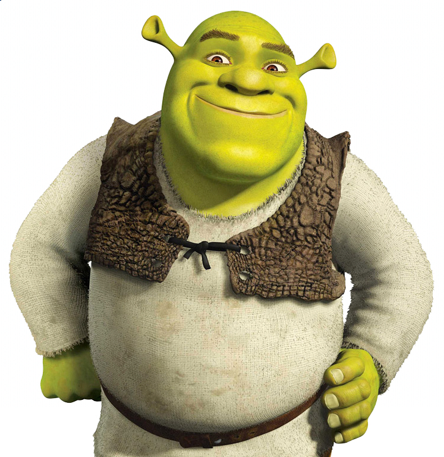

#Simple Text encoder/decoder into an Image
This script just encodes text into an image and can retrieve the text back

#USAGE:
FOR ENCODING: python3 main.py encode <image name> \[file name\] \[output name\]
FOR DECODING: python3 main.py decode <image name> \[output file\]

#DEPENDINCIES:
 * Numpy
 * Pillow

#How it works?
It uses 7bits of each pixel to encode the message, to be exact it uses the last 3bits, 2bits, 2bits from each byte of the 3 bytes rgb pixel.
The program stores META data needed for retrivement in the first 2 pixels (The length, The step). The program tries to space out the used pixels so the image don't get much distorted.
For example, here is a shrek image

We are going to encode the whole transcript of Shrek in the image
using 
`<addr>`python3 main.py encode readme_data/Shrek.jpg readme_data/Shrek_transcript readme_data/encoded_shrek.png
and here are the result

And you can get the text back by

`<addr>`python3 main.py dncode readme_data/encoded_shrek.jpg
